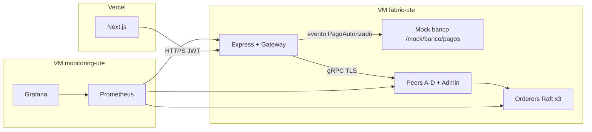
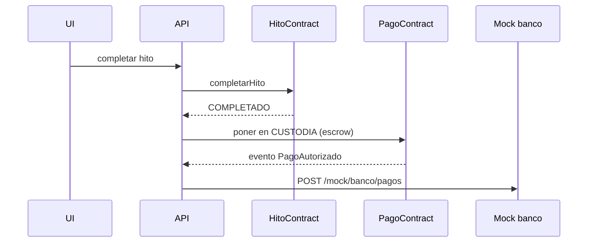

# UTE_BlockChain

Plataforma de Gestión de Uniones Temporales de Empresas (UTE) con Trazabilidad Blockchain.

Registro compartido de hitos, pagos (con escrow) e incidencias. Hyperledger Fabric 2.5, API Express, frontend Next.js.

**Estado y tareas:** [docs/CHECKLIST.md](docs/CHECKLIST.md)  
**Rúbrica → código:** [docs/TRAZABILIDAD.md](docs/TRAZABILIDAD.md)  
**Desviaciones del PDF (memoria):** [docs/MEMORIA-NOTAS.md](docs/MEMORIA-NOTAS.md)

## Arquitectura



Diario en el portátil: mismos MSP y políticas; solo arrancan 3 orderers + peer Empresa A + peer Administración (`make up-dev`). Full añade peers B/C/D (`make up-full`).

## Políticas (canal `UteFull`, 5 orgs)

| Qué | Política | Satisfacible con A+Admin |
| --- | --- | --- |
| Lifecycle (approve/commit) | OutOf(2, 5) | sí |
| Pago | org + Administración | sí |
| Incidencia | OutOf(2, 5) | sí |
| PDC `obra-gruesa-solar` | A o C, `requiredPeerCount: 0` | endoso A con C apagado |
| PDC `quirofanos-tech` | B o D | hace falta peer B o D (perfil full) |

## Árbol

```
network/      Fabric (compose, configtx, scripts)
chaincode/    4 contratos TypeScript (Node 18)
backend/      Express + fabric-gateway (Node 24)
frontend/     Next.js
monitoring/   Prometheus + Grafana (red ute-net)
docs/         CHECKLIST.md es la fuente de verdad
```

## Requisitos locales

- Windows 11 + WSL2 Ubuntu 22.04. **Repo en ext4:** `~/ute/app`, no `C:\Proyectos\...`.
- Cursor: abrir `\\wsl$\Ubuntu-22.04\home\<usuario>\ute\app`.
- Docker Engine en Ubuntu (no Desktop).
- Node 24.20.0 y 18.20.8 (nvm). Fabric 2.5.16 en `PATH`.

## Comandos

```bash
make up-dev          # 3 orderers + A + Admin + canal UteFull
make down-dev
make up-full         # baja dev; 5 peers + 3 orderers
make verify-full
make reset-dev       # down -v, borra *.block, crypto si hace falta, up
make monitoring-up   # requiere ute-net (Fabric ya arriba)
make seed            # día 12; hoy es stub
```

Certificados: `network/organizations/` (no se suben). Regenerar: `FORCE=1 ./network/scripts/generate-crypto.sh`.

## Flujo de pago (objetivo de demo)



## Monitorización

Tres alertas (PDF): peer caído, latencia de bloque > 5 s, error de endorsement > 5 %. Definidas en `monitoring/alerts.yml`. Grafana provisionado en `monitoring/grafana/`.

## Licencia / visibilidad

Repo privado de TFM. Invitar a `DomingoMr`. Sin secretos en Git.
